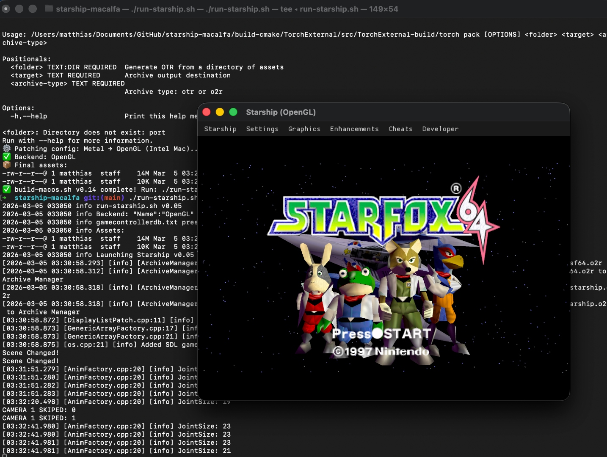
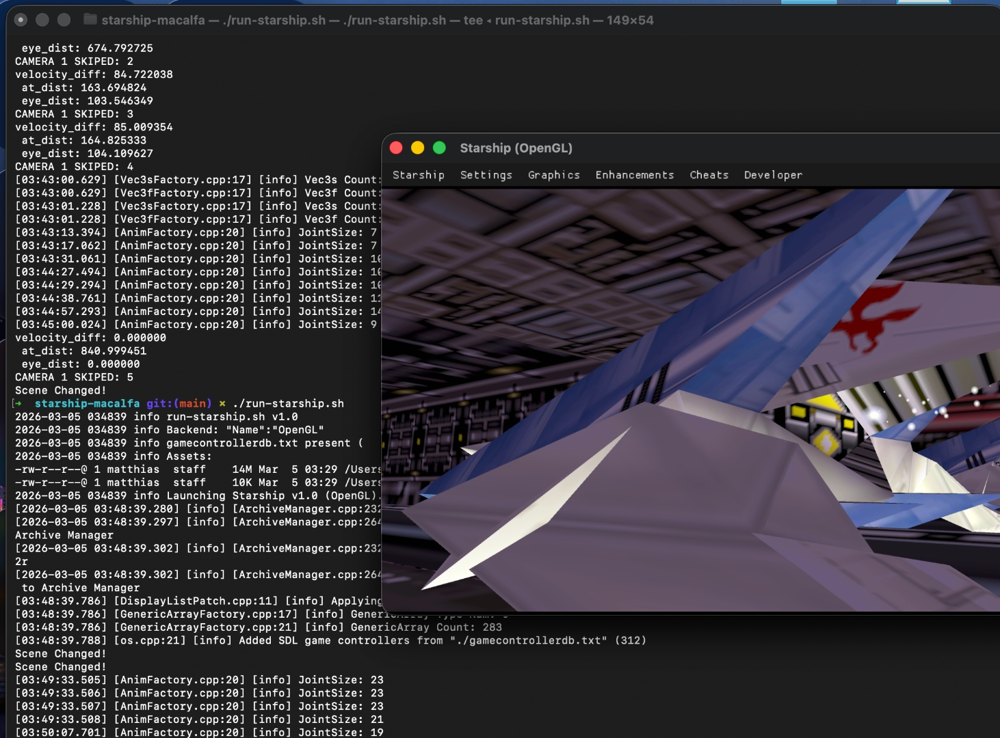
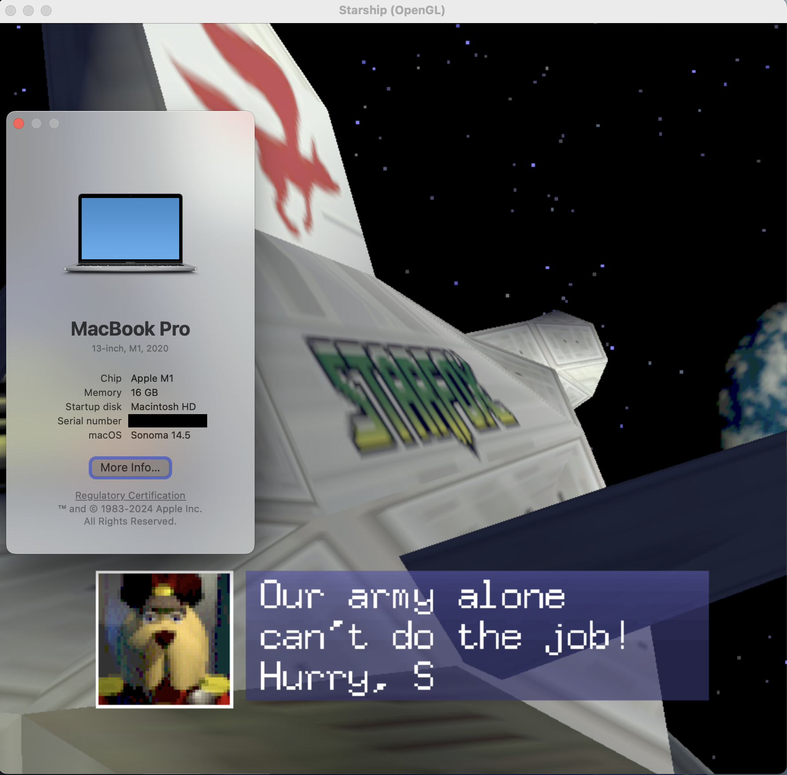

# starship-macalfa

macOS Intel build, bundle, and packaging scripts for the
[HarbourMasters/Starship](https://github.com/HarbourMasters/Starship) SF64 PC port —
targeting **Intel Macs (x86_64) on macOS Tahoe and later**.

Follows the same conventions as
[perfectdark-macvanta](https://github.com/mkoterski/perfectdark-macvanta).

> ⚠️ You need a legally obtained Star Fox 64 N64 ROM to use this.
> The required version is **US Rev 1** (`SHA1: 09F0D105F476B00EFA5303A3EBC42E60A7753B7A`).

---

## Confirmed Working

**Intel Mac (x86_64)** — MacBook Pro 2020, Intel Core i7, macOS Tahoe 26.3:




**Apple Silicon (arm64)** — confirmed via Rosetta 2:



---

## Requirements

* Intel Mac (x86_64) — or Apple Silicon via Rosetta 2
* macOS 12.0 or later (tested on Tahoe 26.3)
* Internet connection (first run only)
* A Star Fox 64 ROM (see above)

All other dependencies (Homebrew, cmake, ninja, SDL2, GLEW) are installed
automatically on first run.

---

## Quick Start

```
git clone https://github.com/mkoterski/starship-macalfa.git
cd starship-macalfa
chmod +x smca-*.sh run-smca-macos.sh

# 1. Install dependencies (run once)
./smca-initial-setup.sh

# 2. Place your ROM, then build
cp /path/to/baserom.us.rev1.z64 roms/
./smca-build-macos.sh

# 3. Run
./run-smca-macos.sh
```

---

## Scripts

| Script | Purpose |
|---|---|
| `smca-initial-setup.sh` | One-time setup: Xcode CLT, Homebrew, packages |
| `smca-build-macos.sh` | Clone upstream, configure cmake, compile binary |
| `smca-bundle-macos.sh` | Wrap binary as `Starship.app` |
| `smca-package-macos.sh` | Create distributable `.dmg` |
| `run-smca-macos.sh` | Launch game (backend switching, asset checks, logging) |
| `smca-systeminfo.sh` | System snapshot for bug reports |
| `smca-collect-crash.sh` | Collect macOS crash reports |
| `smca-patch-hidpi.sh` | Scan/patch Retina HiDPI flags in source |

---

## Backend Switching

Default is OpenGL — required on Intel Mac. Metal crashes with
`std::bad_variant_access` in the prism shader compiler on Tahoe 26.3.
The launcher patches the backend per-session and restores on exit.

```
./run-smca-macos.sh                   # OpenGL (default)
./run-smca-macos.sh --metal           # Metal (testing only)
./run-smca-macos.sh --metal --debug   # Metal + MTL_DEBUG_LAYER
```

---

## Known Issues

* **Metal backend** crashes on Intel Macs (Tahoe 26.3) with `std::bad_variant_access`
  in the prism shader compiler. **Workaround: use OpenGL** — `run-smca-macos.sh`
  patches this automatically.
* **Metal resize handler** uses `SDL_GetWindowSize` (logical points) instead of
  `SDL_Metal_GetDrawableSize` (physical pixels) — needs fixing once Metal is usable.

---

## Versioning

Scripts start at `v0.10` and will reach `v1.0` after confirmed end-to-end
working on a clean Intel Mac running macOS Tahoe.

---

## Credits

* Port: [HarbourMasters/Starship](https://github.com/HarbourMasters/Starship)
* Architecture: [zardulu](https://github.com/zardulu)
* Graphics/Torch: [FSX](https://github.com/FSX)
* Audio: [mysterymath](https://github.com/mysterymath)
* libultraship: [Kenix3](https://github.com/Kenix3)
* macOS scripts: [mkoterski](https://github.com/mkoterski)